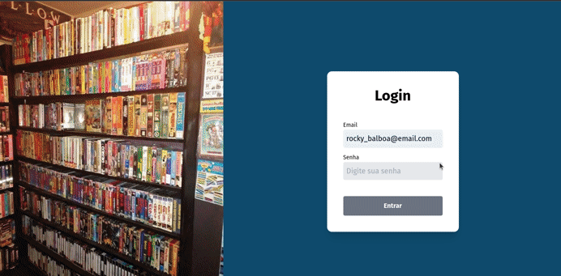
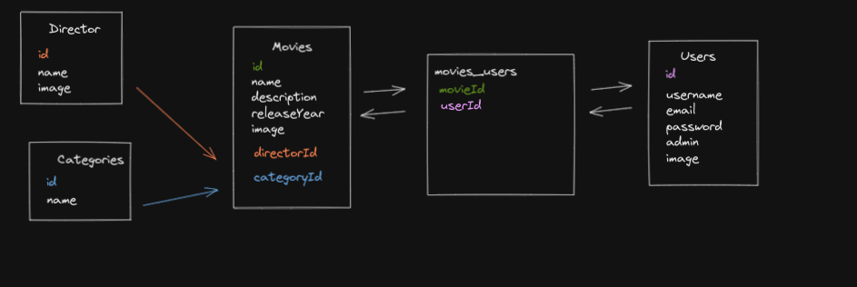

# Projeto Cabralbuster

> Status do projeto: Em andamento ⏳

## Descrição do projeto :dvd:

Uma locadora de filmes que vai matar sua nostalgia dos anos 90.
O site da CabralBuster permite ao usuário:
- Acessar o catalogo de filmes;
- Acessar detalhes sobre os filmes;
- Fitrar os filmes por diretores e categorias;
- Alugar e devolver títulos.

## Demonstração da aplicação funcionando

## Como acessar aplicação

A Cabralbuster está disponivel [nesse link](https://cabralbuster.vercel.app/) e pode ser usado o email `rocky_balboa@email.com` com a senha `lutador` para fazer login na aplicação.

## Regras de negócio

- Um filme pode ser alugado por muitos usuarios e um usuario pode alugar muitos filmes;
- Um filmes pertence a apenas uma categoria e um categoria pode pertencer a muitos filmes;
- Um filme pode ser dirigido por apenas um diretor e um diretor pode dirigir muitos filmes;
- As senhas do usuarios estão encriptografadas;

### Tabelas da aplicação

### Tecnologias utilizadas:
- Typescript; 
- React; 
- React query;
- React modal; 
- Tailwind; 
- Sequelize; 
- MySQL; 

